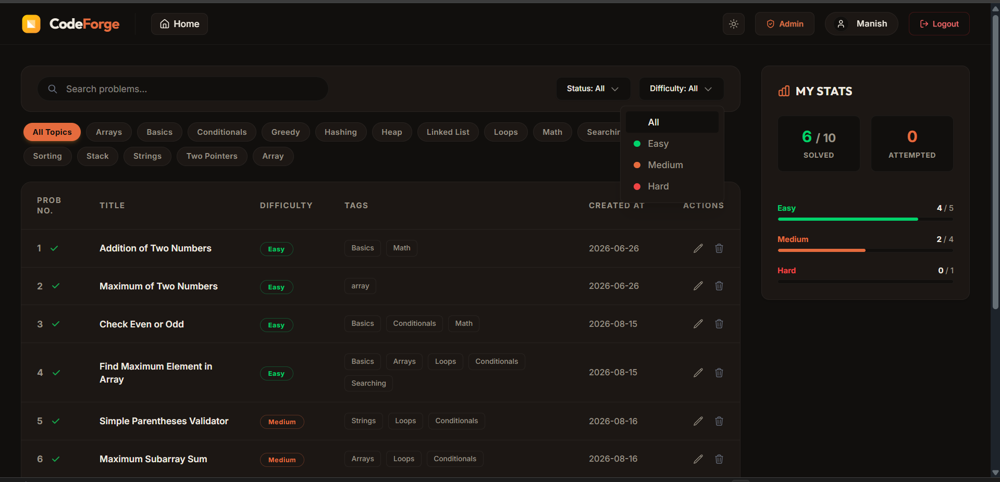
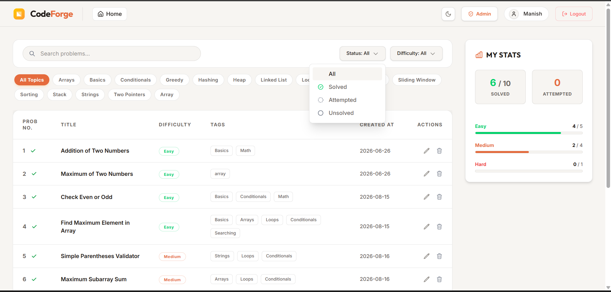
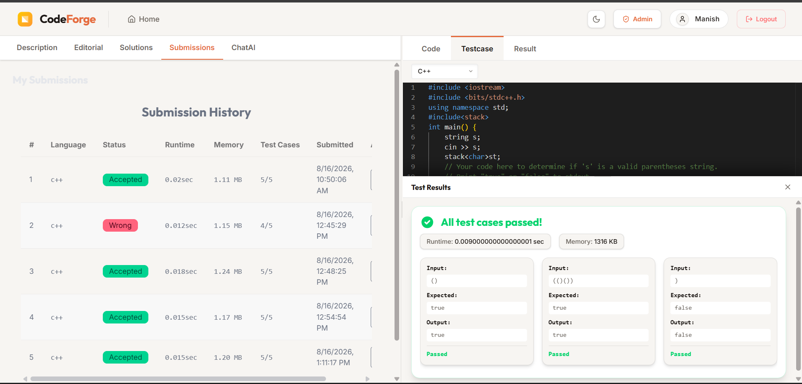
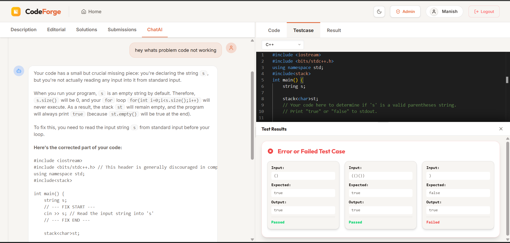
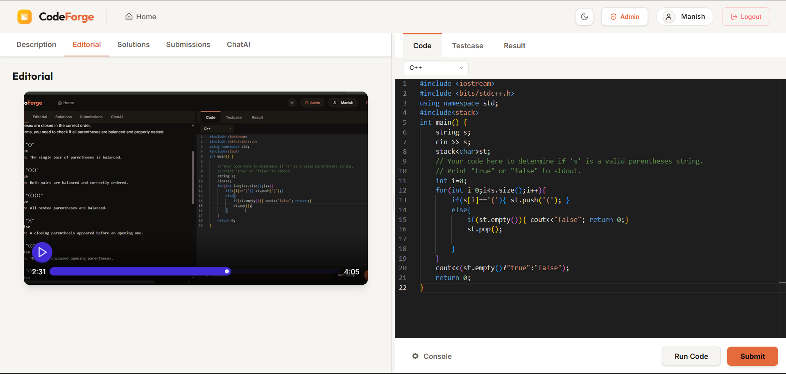
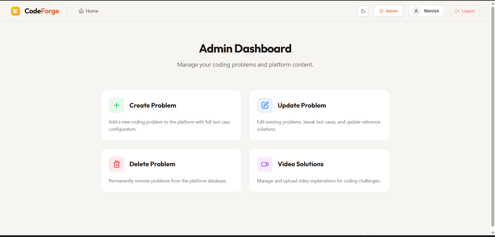
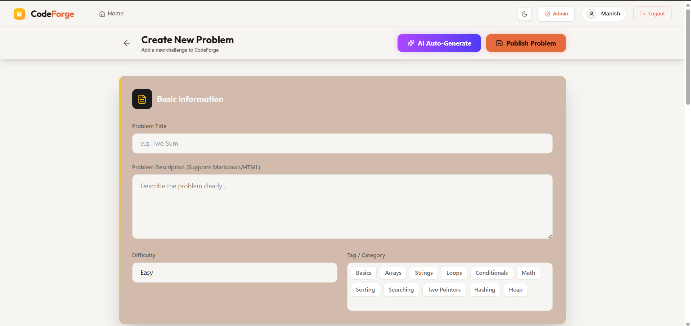

<div align="center">
  <h1>💻 CodeForge</h1>
  <p>A highly scalable, full-stack coding platform inspired by LeetCode, designed to help developers practice and improve their algorithmic skills.</p>
  
  <p>
    
    
    
    
  </p>
</div>

---

## ✨ Features

- **🔐 Secure Authentication:** Robust user login and registration system with JWT-based authentication.
- **📚 Problem Management:** Extensive library of coding problems categorized by difficulty and topic.
- **⚡ Scalable Backend:** RESTful APIs built with Node.js and Express to handle user data and problem sets.
- **💻 Interactive UI:** A clean, responsive, and intuitive interface built with React.js for an optimal coding experience.
- **📈 Progress Tracking:** Monitor your solved problems, submission history, and performance metrics.
- **🏗️ MERN Architecture:** Built completely on a robust MERN stack ensuring a seamless flow of data from the database to the client.

## 📸 Screenshots

*(To display these screenshots properly, please save the images provided in our chat into the `docs/images/` directory with the following filenames)*

### Dashboard (Dark Mode)


### Dashboard (Light Mode)


### Problem Solving & AI Assistant



### Editorials & Solutions


### Admin Panel



## 🛠️ Tech Stack

**Client:**
- React.js
- State Management (Redux/Context API)

**Server:**
- Node.js
- Express.js
- JSON Web Tokens (JWT) for Authentication

**Database:**
- MongoDB
- Mongoose (ODM)

## 🚀 Getting Started

Follow these steps to set up the project locally on your machine.

### Prerequisites

Make sure you have the following installed on your local machine:
- [Node.js](https://nodejs.org/)
- Git
- MongoDB (Local or Atlas URI)

### Installation

1. **Clone the repository**
   ```bash
   git clone https://github.com/manishcodess/CodeForge.git
   cd CodeForge
   ```

2. **Setup Backend**
   ```bash
   cd backend
   npm install
   # Create a .env file and add your MongoDB URI and PORT
   npm start
   ```

3. **Setup Frontend**
   ```bash
   cd ../frontend
   npm install
   npm run dev
   ```

4. **Open the application**
   Open your browser and navigate to the local host port provided by your frontend framework (e.g., `http://localhost:5173` or `http://localhost:3000`).

## 📁 Folder Structure

```text
CodeForge/
├── backend/       # Node.js & Express.js server, API routes, models, controllers
├── frontend/      # React.js application, components, pages, state
└── README.md      # Project documentation
```

## 🤝 Contributing

Contributions, issues, and feature requests are welcome! Feel free to check the [issues page](https://github.com/manishcodess/CodeForge/issues).

1. Fork the project.
2. Create your feature branch (`git checkout -b feature/AmazingFeature`).
3. Commit your changes (`git commit -m 'Add some AmazingFeature'`).
4. Push to the branch (`git push origin feature/AmazingFeature`).
5. Open a Pull Request.

## 📜 License

This project is licensed under the MIT License - see the LICENSE file for details.

---
<div align="center">
  <i>Built with ❤️ by Manish</i>
</div>
