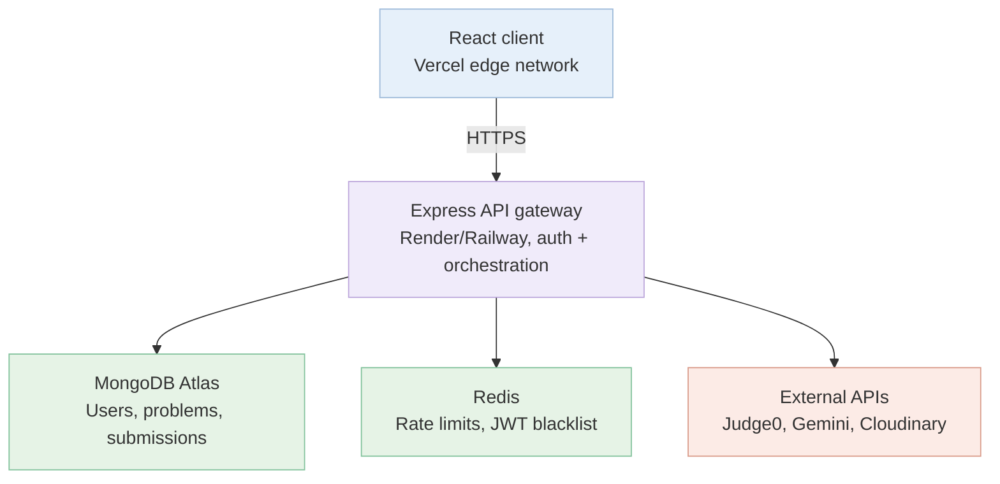
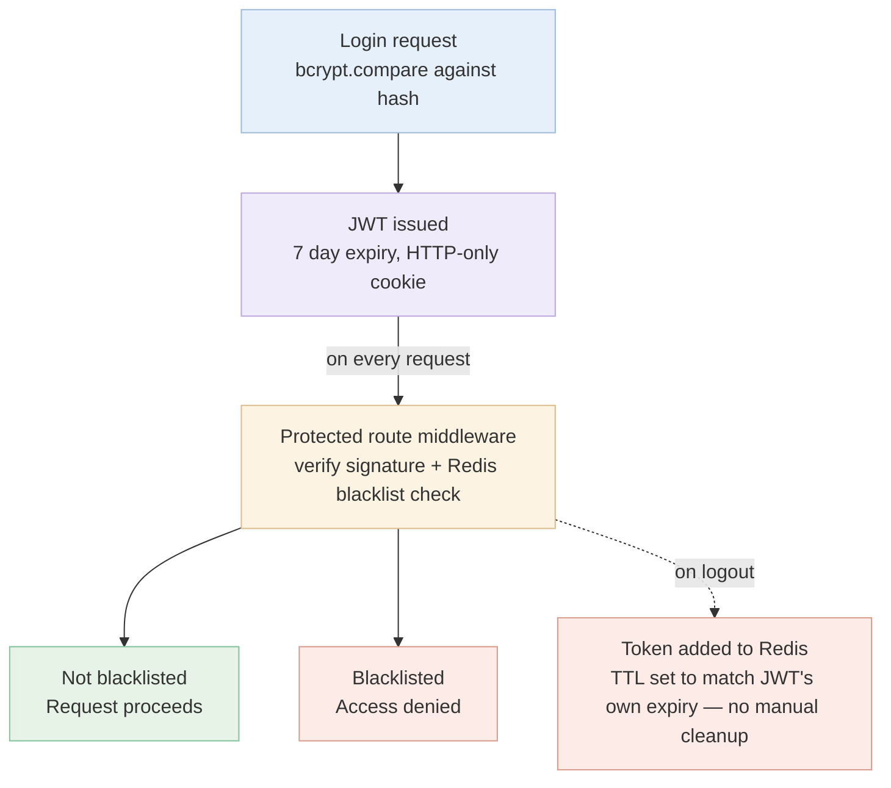

<div align="center">
  <h1>💻 CodeForge</h1>
  <p><strong>A highly scalable, full-stack coding platform to practice algorithms and ace your interviews.</strong></p>

  <p>
    <a href="https://code-forge-brown.vercel.app/"></a>
    
    
  </p>
  <p>
    
    
    
    
  </p>
</div>

---

## 📸 Demo

> **Live Demo:** [code-forge-brown.vercel.app](https://code-forge-brown.vercel.app/)

*(To display these screenshots properly, please save the images into the `docs/images/` directory)*

### Dashboard
| Dark Mode | Light Mode |
|:---:|:---:|
|  |  |

### Problem Solving & Assistance
| Code Editor | AI Chat Assistant |
|:---:|:---:|
|  |  |

### Editorials & Admin
| Video Editorial | Admin Dashboard |
|:---:|:---:|
|  |  |

### Problem Management
| Create Problem |
|:---:|
|  |

## ✨ Features

- **🔐 Secure Authentication:** JWT-based user login and registration system.
- **📚 Problem Library:** Extensive library of coding problems by difficulty and topic.
- **🤖 AI Assistant:** Integrated AI chat to help debug and understand optimal solutions.
- **⚡ Fast Code Execution:** Secure compilation and execution environment.
- **📈 Progress Tracking:** Monitor solved problems, submission history, and performance metrics.
- **🎨 Modern UI/UX:** Responsive, interactive interface with dark/light mode built with React.

## 🛠️ Tech Stack

| Category | Technologies |
|---|---|
| **Frontend** | React.js, Redux Toolkit, TailwindCSS/Vanilla CSS |
| **Backend** | Node.js, Express.js |
| **Database** | MongoDB, Mongoose |
| **Authentication** | JSON Web Tokens (JWT) |
| **Deployment** | Vercel (Frontend), Render/Railway (Backend) |

## 🏛️ Architecture



## 📁 Folder Structure

```text
CodeForge/
├── backend/                  # Node.js & Express.js server
│   ├── src/
│   │   ├── controllers/      # Request handlers
│   │   ├── middleware/       # JWT auth & validation (e.g., optionalUserMiddleware)
│   │   ├── models/           # Mongoose schemas
│   │   └── routes/           # API endpoints (e.g., aiChatting.js)
│   └── package.json
├── frontend/                 # React.js application
│   ├── src/
│   │   ├── components/       # Reusable UI components (Navbar, AdminUpdateAi)
│   │   ├── pages/            # View components (Admin, Home)
│   │   └── authSlice.js      # Redux state management for auth
│   └── package.json
└── docs/                     # Documentation and assets (LLD, diagrams)
```

## 🚀 Installation & Setup

1. **Clone the repository**
   ```bash
   git clone https://github.com/manishcodess/CodeForge.git
   cd CodeForge
   ```

2. **Setup Backend**
   ```bash
   cd backend
   npm install
   # Create .env and configure PORT, MONGO_URI, JWT_SECRET, AI_API_KEY
   npm start
   ```

3. **Setup Frontend**
   ```bash
   cd ../frontend
   npm install
   # Create .env and configure VITE_API_BASE_URL (if using Vite) or REACT_APP_API_URL
   npm run dev
   ```

4. **Open the App:** Navigate to `http://localhost:5173` (or `3000`).

## 📡 API Usage & Endpoints

Base URL: `/api/v1`

| Endpoint | Method | Description | Auth Required |
|---|---|---|---|
| `/auth/register` | `POST` | Register a new user | No |
| `/auth/login` | `POST` | Login and receive JWT | No |
| `/problems/:id` | `GET` | Get problem details | Optional |
| `/problems/:id/submit` | `POST` | Submit code for execution | Yes |
| `/chat/ai` | `POST` | Interact with AI assistant | Yes |

*See full API documentation and postman collection in the `/docs` folder.*

## 🔄 Auth & Request Flow



## 🧪 Testing

The platform utilizes a combination of unit testing and integration testing to ensure reliability.
- **Backend:** API endpoint testing with Jest and Supertest.
- **Frontend:** Component testing using React Testing Library.

Run tests using `npm test` in the respective directories.

## ☁️ Deployment

- **Frontend:** Hosted on [Vercel](https://vercel.com) for edge caching and fast global delivery. Continuous deployment configured via GitHub.
- **Backend:** Hosted on a scalable Node.js environment (e.g., Render or Railway) connecting to a managed MongoDB Atlas cluster.

## 🤝 Contributing

Contributions, issues, and feature requests are welcome!

1. Fork the project.
2. Create your feature branch (`git checkout -b feature/AmazingFeature`).
3. Commit your changes (`git commit -m 'Add some AmazingFeature'`).
4. Push to the branch (`git push origin feature/AmazingFeature`).
5. Open a Pull Request.

## 📜 License

This project is licensed under the [MIT License](LICENSE) - see the LICENSE file for details.
